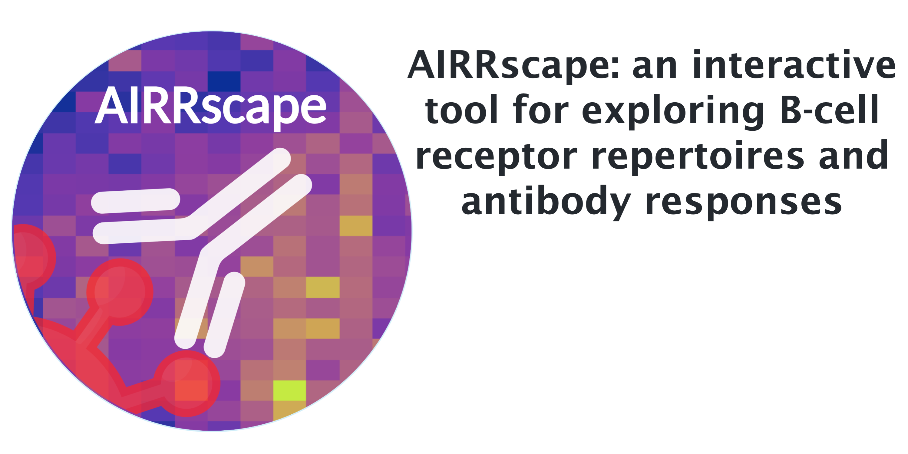

## Dependencies & R Session Info
**AIRRscape is available as a web tool at https://airrscape.czbiohub.org.**
To run AIRRscape locally, R & RStudio must be installed. AIRRscape was developed using R v4.2.0 with RStudio v2022.02.2.
Attached base R packages:	_stats, graphics, grDevices, utils, datasets, methods, base_

Other attached packages:
	_shinyscreenshot_0.2.0, phangorn_2.8.1, ape_5.6-2, seqinr_4.2-16, DT_0.23, forcats_0.5.1, stringr_1.4.0, dplyr_1.0.9, purrr_0.3.4, readr_2.1.2, tidyr_1.2.0, tibble_3.1.7, tidyverse_1.3.1, alakazam_1.2.0, ggplot2_3.3.6, shiny_1.7.1_

## Running AIRRscape
**Launch AIRRscape at https://airrscape.czbiohub.org.** Basic instructions are shown in the left sidebar. When first launching, AIRRscape may take 10-20 seconds to load.

To run AIRRscape locally, clone this repo, open the ```app.R``` file in RStudio, and then click "Run App". AIRRscape can run in a window of RStudio or as a tab in a web browser (recommended).

Upon starting AIRRscape, the main panel shows basic instructions and options of the _Import Data_ tab. Click on the _AIRRscape_ tab to view a set of heatmaps. Choose between datasets by selecting from the options in the top dropdown menu of the sidebar. Datasets of multiple repertoires can be visualized either as separate heatmap panels (labeled "IgH"), or as a single combined heatmap (labeled "IgH combined").
To view custom datasets (.tab or .tsv files in AIRR-C format), first use the _Import Data_ tab to upload datasets, convert+combine them, and then download the processed files. Next, upload these files and select "Custom datasets - IgH" or "Custom datasets - IgH combined" from the dropdown menu.

### _Import Data_ tab
To import datasets, first upload each dataset separately (maximum 6). As long as they follow AIRR-C standards (.tab or .tsv), they will be automatically converted for viewing in AIRRscape. Metadata is not required; simply enter the name of each dataset, which will be used as labels in each faceted dataset. Then, click the combine button to begin processing the datasets. Note the processing occurs in the background, so next just click the two download buttons separately to get the processed files - depending on dataset size, it might take 10-20 seconds before the download begins. Upload these two files in the main _AIRRscape_ tab for viewing.

### _AIRRscape_ tab
The heatmaps split antibody repertoires into bins based on their germline V-gene family + J-gene assignments (x-axis) and their CDR3 lengths (y-axis). Select the fill color for the bins using the second dropdown menu in the sidebar: color by 1) average somatic hypermutation (SHM), 2) maximum SHM, or 3) percent of total (i.e. what percent of antibodies in that panel are found in that bin).

To interactively explore the data using the heatmap: 1) hover over a bin to get a popup window showing some basic stats, 2) create a bounding box to get a (upper) table of all the antibodies within the box, or 3) click on a single bin to get a (lower) table of its antibodies. Note that these tables will appear in two different spots below the heatmap, and they can be sorted by any of the columns. From either table, use the search bar to search for an antibody of interest or to limit the table to a single attribute (i.e. one germline V-gene). Note that the upper table displaying antibodies within the bounding box can only be used for searches of antibody sequences. For further functionality, use the lower table after clicking on a single bin.

Available options from the lower table of antibodies are: 1) download all or 2) selected antibodies in the chosen bin, 3) download the distance matrix of all antibodies, or 4) create topologies of selected antibodies based on their CDR3 amino acid motifs. There are multiple options for making topologies. The most straightforward is to manually choose between 3 and ~500 antibodies from the table, and choose either the 'NJ' or 'parsimony' options. A topology with the selected antibodies will appear below. Another option is to select a single antibody sequence, and then choose one of the last four topology options. These will search the entire table and display the topology of all CDR3 motifs in that bin within the chosen identity threshold (based on amino acid distance). Four thresholds are available, ranging from 50% - 100% identity.

The default height and width of topologies may not be optimal for viewing, depending on the number of antibodies or the screen size. Use the sliders to adjust the height and width. The topology tips include the antibody names, as well as the CDR3 motifs and V-gene assignments. Lastly, the button below the topology labeled "Take a screenshot" will save an image of the entire page including the heatmap, table, and topology.


## Datasets and code for manuscript
This repository is split into sections. The 'shinyapp' folder contains the AIRRscape app and loaded datasets. The 'paper_assets' folder contains partially processed datasets & R scripts used for their processing. The ```airrscape_preprocessing.R``` script is used to combine datasets from repositories in AIRR-C format (datasets here include all columns). The ```airrscape_processing.R``` script is used to convert & combine partially processed datasets into the files directly used in AIRRscape. This script also includes a custom function ```AIRRscapeprocess``` that trims datasets and creates AIRRscape-specific columns for any AIRR-C formatted repertoire dataset. Note that the  _Import Data_ tab includes this function to convert user-uploaded datasets.

## Tips
We recommend using AIRRscape as a tab on a web browser (and as wide as possible). The sizes of processed repertoires are reduced by removing reads with identical CDR3 motifs & germline assignments, and each pre-loaded repertoire contains up to 200,000 sequences. The heatmaps of these repertoires take only few seconds to load, but the largest dataset "SARS-CoV2 HIV & Dengue datasets - IgH combined" will take longer to load.

For topology building, there is an upper limit for calculating these in real-time. We recommend limiting these to no more than 500 sequences. When finding the most closely related CDR3 motifs to an antibody sequence of interest, note that the topology will be limited to 500 sequences. Similarly, when viewing the largest combined datasets, take note of the number of sequences in the bin of interest. On a typical laptop running RStudio searching a bin of 1000 sequences for the most closely related CDR3 motifs will take about 1 minute, and about 20 seconds using the web portal. Note that searches of larger bins will take considerably longer - searching ~7,500 sequences will take 12-15 minutes and may not finish before timing out on the web portal, which will disconnect after 15 minutes of inactivity.

Note that after exploring one table for some time, it is possible to unwittingly have multiple antibodies selected but not in view - this will affect the topology-making options. A simple solution is to click on another bin, and then click back on the bin of interest thus refreshing the table. Also note that the topologies require the selected antibodies to all have the same CDR3 length - otherwise the calculation will fail with an error: ```Warning: Error in <-: length of 'dimnames' [1] not equal to array extent```. This error is likely to result after clicking on a bin while viewing repertoires displayed across multiple panels - in that case, the table will sometimes include sequences with multiple CDR3 lengths. In this scenario, finding the most closely related CDR3 motifs to an antibody sequence of interest will fail, though manually creating NJ or parsimony topologies of antibodies with the same CDR3 length will work.

Other warnings may occur if there are only 1 or 2 closely related CDR3 motifs: ```Warning: Error in [[: subscript out of bounds``` & ```Warning: Error in nj: cannot build an NJ tree with less than 3 observations```. Finally, if viewing selected antibodies from the (upper) table made via a bounding box, the topology functions will not work and instead show an error: ```Error: argument is of length zero```. Note that when using the web portal, specific errors may not be shown, instead a generic error: ```Error: an error has occurred. Check your logs or contact the app author for clarification```.

## Citation
If you use AIRRscape, please cite our publication:

**AIRRscape: an interactive tool for exploring B-cell receptor repertoires and antibody responses**

Eric Waltari, Saba Nafees, Krista M. McCutcheon, Joan Wong, John E. Pak

PLOS Computational Biology 2022; doi: https://doi.org/10.1371/journal.pcbi.1010052
