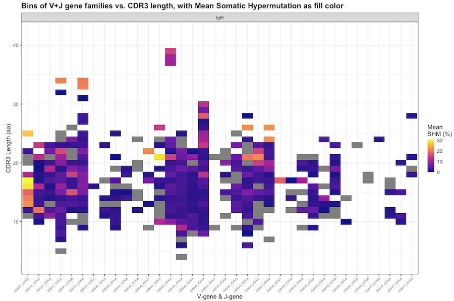

# AIRRscape: an interactive tool for exploring B-cell receptor repertoires and antibody responses  


## Dependencies & R Session Info
**AIRRscape is available as a web tool, running at http://airrscape.czbiohub.org.**
To run AIRRscape locally, have R & RStudio downloaded: https://www.rstudio.com/products/rstudio/download/.
AIRRscape was initially developed using R v4.0.3, with subsequent updates made using R v4.2.0, and with RStudio v2022.02.2. The ```sessionInfo()``` shows:

Attached base packages:
	_stats graphics grDevices utils datasets methods base_

Other attached packages:
	_shinyscreenshot_0.2.0 phangorn_2.8.1 ape_5.6-2 seqinr_4.2-16 DT_0.23 forcats_0.5.1 stringr_1.4.0 dplyr_1.0.9 purrr_0.3.4 readr_2.1.2 tidyr_1.2.0 tibble_3.1.7 tidyverse_1.3.1 alakazam_1.2.0 ggplot2_3.3.6 shiny_1.7.1_

## Running AIRRscape
**AIRRscape is available as a web tool, running at http://airrscape.czbiohub.org.**
To run AIRRscape locally, clone the repo and open the ```app.R``` file in your RStudio, then click "Run App". As a Shiny app, it can run as a window of RStudio, or as a tab in a web browser (recommended).

Basic instructions are shown on the left hand side of the window.
When you start AIRRscape you will first see the options for the _Import Data_ tab. If you click on the _AIRRscape_ tab you will see a set of heatmaps - to choose between datasets shown select the dataset from the options in the top selectable list on the left. Datasets of multiple repertoires can be visualized either as separate heatmap panels, or as a single combined heatmap (labeled 'combined').
To view your own inputted datasets (in AIRR-C format saved as .tsv or .tab files), first use the _Import Data_ tab to convert+combine and then download. You can view these after uploading by selecting "Custom datasets - IgH" or "Custom datasets - IgH combined"

### _Import Data_ tab
To import datasets, first upload each of your separate datasets (maximum 6). As long as they are in AIRR format (tab or tsv), they will be automatically converted for viewing in AIRRscape. You do not need any metadata, simply input the name of each dataset and these names will be in each faceted dataset. Next click the combine button (which will not immediately have a result). Finally click each download button separately to get the two files. You can then upload these two files in the main _AIRRscape_ tab for viewing.

### _AIRRscape_ tab
The heatmaps split antibody repertoires into bins based on their germline V-gene family + J-gene assignments (x-axis), and their CDR3 lengths (y-axis). The second selectable list on the left lets you select the fill color for the bins: either by average somatic hypermutation (SHM), maximum SHM, or by percent of total (i.e. what percent of antibodies in that panel are found in that bin).

You can interactively explore the data in the heatmap: you can 1) hover over a bin to get a popup window showing some basic stats, you can 2) create a bounding box to get a table of all the antibodies within the box, and finally you can 3) click on a single bin to get a table of antibodies in just that bin. The bounding box table and clicked table will appear in two different spots below the heatmaps. From either table, you can sort the table by any of the columns. You can also use the search bar to search for an antibody of interest, or even to limit the table to a single attribute (i.e. one germline). Note that the upper table showing antibodies within a bounding box is for searches of antibody sequences of interest - for further functionality, select the bin with your antibody of interest.

From the lower table of antibodies (after clicking on a selected bin), you can download all or selected antibodies in the chosen bin, download the distance matrix of all antibodies, or create topologies of selected antibodies based on their CDR3 amino acid motifs. There are multiple options for making topologies. The most straightforward is to manually choose between 3 and ~500 antibodies from the table, and choose either the 'NJ' or 'parsimony' options. A topology with your selected antibodies will appear below. Another option is to select just a single antibody of interest, and the choose one of the last four topology options. These will search the entire table, and show you the topology of all CDR3 motifs in that bin that are within the chosen identity threshold (based on amino acid distance). Four thresholds are available, ranging from 50% - 100% identity.

The topologies default to a particular height and width that may not be optimal given the number of antibodies, or the size of your screen. You can adjust the height and width using the sliders just above the topology. The topology tips include the antibody names as well as the CDR3 motifs (in Courier New font so as to be aligned), and the V-gene assignments. Lastly, the button below the topology labeled "Take a screenshot" will save an image of the entire page including heatmaps, tables, and topology.


## Datasets and code for manuscript
The repository is split into the AIRRscape app and loaded datasets (shinyapp folder), and partially processed datasets & code used to process these loaded datasets for the manuscript (paper_assets folder). There are two R scripts in the paper_assets folder: the ```airrscape_preprocessing.R``` script includes the initial R code for combining datasets from repositories in AIRR format (datasets here include all columns). The ```airrscape_processing.R``` script includes code that will combine partially processed datasets to the loaded sets directly used in AIRRscape. This script also includes a custom function ```AIRRscapeprocess``` that does this trimming and calculation of AIRRscape-specific columns for any AIRR-formatted repertoire dataset (in a .tab format). Note that the  _Import Data_ tab includes this function to convert user-inputted datasets.

## Tips
We recommend using AIRRscape as a tab on a web browser, as wide as possible. By removing reads with identical CDR3 motifs & germline assignments during processing, each pre-loaded repertoire contains up to 200,000 sequences. The heatmaps of these repertoires do not take more than a few seconds to load, but the option of all datasets "SARS-CoV2 HIV & Dengue datasets - IgH combined" will take longer to load.
When building topologies there is an upper limit for making these on the fly. We recommend limiting these to no more than 500 sequences. When finding the most closely related CDR3 motifs to an antibody sequence of interest, note that the topology will be limited to 500 sequences. Similarly, when viewing the largest combined datasets, note the number of sequences in your bin of interest.
On a typical laptop running RStudio searching a bin of 1000 sequences for the most closely related CDR3 motifs will take about 1 minute, and about 20 seconds using the web portal. Note that searches of larger bins will take considerably longer - searching ~7,500 sequences will take 12-15 minutes and may not finish before timing out on the web portal, which will disconnect after 15 minutes of inactivity.

Note that after exploring one table for some time, it is possible to unwittingly have multiple antibodies selected but not in view - this will affect the topology-making options. A simple solution is to click on another bin, and then click back on the bin of interest thus refreshing the table. Also note that the topologies require the selected antibodies to all have the same CDR3 length - otherwise the calculation will fail with an error: ```Warning: Error in <-: length of 'dimnames' [1] not equal to array extent```. This error is likely to result after clicking on a bin while viewing repertoires displayed across multiple panels - in that case, the table will sometimes include sequences with multiple CDR3 lengths. In this scenario, finding the most closely related CDR3 motifs to an antibody sequence of interest will fail, though manually creating NJ or parsimony topologies of antibodies with the same CDR3 length will work.

Other warnings may occur if there are only 1 or 2 closely related CDR3 motifs: ```Warning: Error in [[: subscript out of bounds``` & ```Warning: Error in nj: cannot build an NJ tree with less than 3 observations```. Finally, if the user has selected antibodies from the table made via a bounding box rather than via clicking on a bin, the topology functions will not work and instead show an error: ```Error: argument is of length zero```. Note that when using the web portal, specific errors may not be shown, instead a generic error: ```Error: an error has occurred. Check your logs or contact the app author for clarification```.

## Citation
To cite AIRRscape in publications, use:

**AIRRscape: an interactive tool for exploring B-cell receptor repertoires and antibody responses**

Eric Waltari, Saba Nafees, Joan Wong, Krista M. McCutcheon, John E. Pak

bioRxiv 2022.03.24.485594; doi: https://doi.org/10.1101/2022.03.24.485594

(modified using RStudio)
